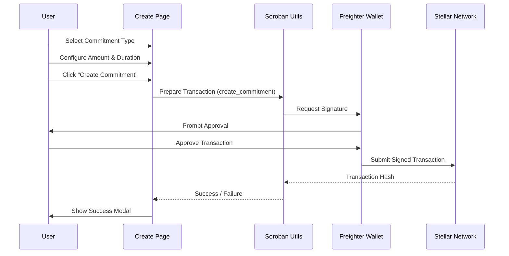

# System Architecture

This document details the architectural design of the CommitLabs Frontend application, including component responsibilities, data flow, and integration points.

## 🏗 High-Level Architecture

The application follows a standard **Next.js App Router** architecture, leveraging Server Components for static rendering and Client Components for interactivity.

### Component Diagram

```mermaid
graph TD
    User[User / Browser]
    NextApp[Next.js Application]
    
    subgraph "Frontend Layer"
        Page[Pages (src/app)]
        Comp[Components (src/components)]
        Hooks[React Hooks]
        Context[React Context]
    end
    
    subgraph "Integration Layer"
        SorobanUtils[Soroban Utils (src/utils/soroban.ts)]
        Wallet[Wallet Adapter (Freighter)]
    end
    
    subgraph "Blockchain Layer"
        Stellar[Stellar Network]
        Contracts[Soroban Smart Contracts]
    end
    
    User -->|Interacts| Page
    Page -->|Renders| Comp
    Comp -->|Uses| Hooks
    Hooks -->|Calls| SorobanUtils
    SorobanUtils -->|Connects| Wallet
    SorobanUtils -->|RPC Calls| Stellar
    Wallet -->|Signs Tx| Stellar
    Stellar -->|Executes| Contracts
```

## 🧩 Core Modules

### 1. Commitment Management

Responsible for the lifecycle of liquidity commitments: creation, monitoring, and settlement.

-   **Creation Flow**: A wizard-style interface (`src/app/create`) guides the user through configuring asset, amount, duration, and risk parameters.
-   **Data Model**:
    -   `Commitment`: Represents a single commitment contract.
    -   `CommitmentType`: Enum (`Safe`, `Balanced`, `Aggressive`).
-   **Key Components**:
    -   `CreateCommitmentStepSelectType`: Selection of risk profile.
    -   `CreateCommitmentStepConfigure`: Detailed parameter input.
    -   `CommitmentForm`: (Legacy/Refactor target)

### 2. Dashboard & Visualization

Provides real-time insights into commitment performance.

-   **Health Metrics**: Visualizes value history, drawdown, and compliance.
-   **Key Components**:
    -   `CommitmentHealthMetrics`: Container for charts.
    -   `HealthMetricsValueHistoryChart`: Line chart of asset value.
    -   `HealthMetricsDrawdownChart`: Area chart of value drops.
    -   **Libraries**: `recharts` for rendering SVG charts.

### 3. Marketplace

A secondary market for trading active commitments.

-   **Listing**: Displays available commitments with filtering.
-   **Filtering**: `MarketplaceFilters` component allows filtering by type, price, duration, etc.
-   **Data Flow**:
    -   Currently uses mock data (`mockListings` in `src/app/marketplace/page.tsx`).
    -   Future state: Query Soroban contract for active listings.

## 🔄 Data Flow

### Commitment Creation Sequence



## 🔌 External Integrations

### Soroban Smart Contracts

The application interacts with three primary contracts:
1.  **Commitment Core**: Manages the logic of creating and settling commitments.
2.  **Commitment NFT**: Represents ownership of the commitment.
3.  **Attestation Engine**: Verifies external data (e.g., price feeds) for compliance.

### Wallet Integration

-   **Provider**: `@stellar/freighter-api`
-   **Usage**: Used to sign transactions for creating commitments and listing items on the marketplace.
-   **Status**: Currently in development (see `src/utils/soroban.ts`).

## 🛡 Security & Performance

-   **Input Validation**: All user inputs (amount, duration) are validated client-side before submission.
-   **Error Handling**: Transaction failures are caught and displayed to the user via Modals.
-   **Optimization**: 
    -   `recharts` components are lazy-loaded where possible.
    -   Static generation is used for marketing pages (`src/app/page.tsx`).

## 🔮 Future Improvements

-   **Real-time Data**: Replace mock data with live contract queries using a generated Soroban client.
-   **Caching**: Implement `React Query` or similar for caching blockchain data.
-   **Type Safety**: Generate TypeScript definitions directly from Soroban XDR files.
